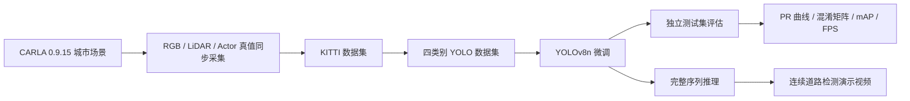
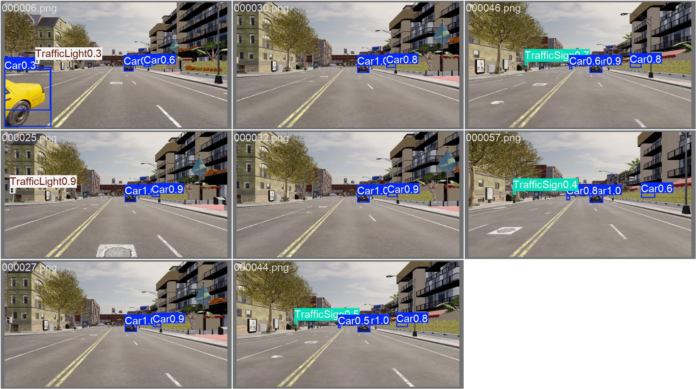

# Xiaomi Auto Drive

基于视觉的城市道路端到端自动驾驶仿真系统。本仓库汇总项目前三周成果，覆盖 CARLA 仿真环境、城市道路多传感器数据采集、KITTI/YOLO 数据转换、YOLOv8 四类别目标检测、性能评估和连续场景演示。

> 本项目用于课程学习与仿真实验，不代表小米汽车官方产品，也不与小米集团存在隶属或授权关系。

## 项目进度

| 周次 | 阶段 | 核心成果 | 完整提交包 |
| --- | --- | --- | --- |
| Week 1 | 环境搭建与仿真验证 | WSL2、Ubuntu 22.04、CARLA 0.9.15 环境；交通流与人工驾驶验证 | [下载 xiaomi_week1.zip](https://github.com/xuzihao723/xiaomi-auto-drive/releases/download/week1-submission/xiaomi_week1.zip) |
| Week 2 | 数据采集与格式转换 | RGB + LiDAR 同步采集；1000 帧城市道路数据；KITTI 标签与自动验收 | [下载 xiaomi_week2.zip](https://github.com/xuzihao723/xiaomi-auto-drive/releases/download/week2-submission/xiaomi_week2.zip) |
| Week 3 | 感知模块开发 | YOLOv8 四类别检测；独立测试集评估；FPS 测试；一分钟演示视频 | [下载 xiaomi_week3.zip](https://github.com/xuzihao723/xiaomi-auto-drive/releases/download/week3-submission/xiaomi_week3.zip) |

## 系统流程



更详细的模块关系见 [系统架构说明](docs/system-architecture.md)，每周工作记录见 [阶段进度说明](docs/weekly-progress.md)。

## 第三周检测结果

检测类别：`Car`、`Pedestrian`、`TrafficLight`、`TrafficSign`。

| 指标 | 结果 |
| --- | ---: |
| Precision | 0.717 |
| Recall | 0.708 |
| mAP@0.5 | 0.707 |
| mAP@0.5:0.95 | 0.538 |
| CPU 推理速度 | 15.27 FPS |
| 演示序列 | 1000 帧 / 66.67 秒 |



## 仓库结构

```text
xiaomi-auto-drive/
├── README.md
├── docs/                         # 总体架构与阶段进度
├── week1-environment/            # 环境搭建文档与验证截图
├── week2-data-pipeline/          # CARLA 采集、传感器配置与 KITTI 转换
└── week3-perception/             # YOLOv8 训练、评估、推理与报告
```

主分支用于保存可审阅、可维护的代码、配置、文档和代表性结果。原始数据集、模型权重和演示视频体积较大，统一放在对应的 GitHub Release 附件中。

## 快速开始

### Week 2：CARLA 数据采集

```bash
cd week2-data-pipeline
python -m venv .venv
source .venv/bin/activate
python -m pip install -r requirements.txt
```

CARLA Server 运行在 Windows，Python Client 可运行在 WSL2 Ubuntu 22.04。详细命令见 [Week 2 README](week2-data-pipeline/README.md)。

### Week 3：目标检测

```bash
cd week3-perception
python -m venv .venv
source .venv/bin/activate
python -m pip install -r requirements.txt
```

完整 ZIP 解压后，可直接使用 `weights/best.pt` 进行评估或推理。详细命令见 [Week 3 README](week3-perception/README.md)。

## 提交包校验

| 文件 | SHA256 |
| --- | --- |
| `xiaomi_week1.zip` | `23D4E796FE74ED7A06BC39A054117DD8A0F9B4D187E433D7E1441A3B54861A44` |
| `xiaomi_week2.zip` | `13608408E19E2F42C8D543A14DBC60B0A855582624FDB519B239D6D7EC7D8767` |
| `xiaomi_week3.zip` | `994BD829C51714C3C21A4B955FE59C80FBF5FB43198D43C3BA9054320BB7B774` |

## 当前局限性

- Week 3 的交通灯和交通标志标签由伪标注生成并抽查，不应视为完全人工标注真值。
- TrafficSign 样本数量较少，指标波动大于其他类别。
- 数据主要来自 Town10HD 单地图及相邻连续帧，跨地图、天气和时间条件的泛化仍需验证。
- 当前速度数据为 CPU 基准，尚未完成 TensorRT 和真实车载端到端延迟测试。

## 技术栈

- CARLA 0.9.15
- Windows 11 + WSL2 Ubuntu 22.04
- Python 3.10+
- PyTorch / Ultralytics YOLOv8
- OpenCV / NumPy / Matplotlib / ReportLab

