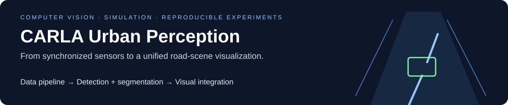
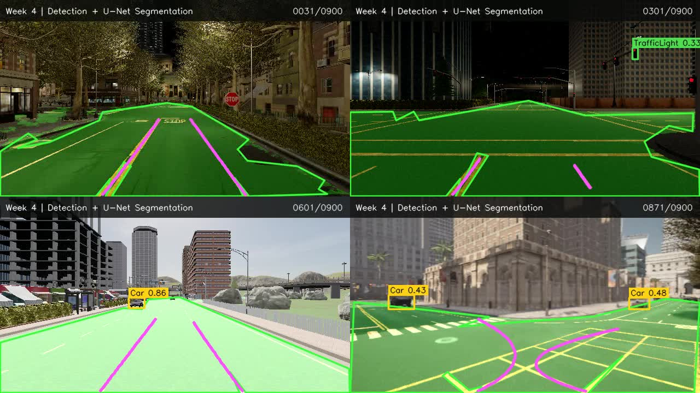
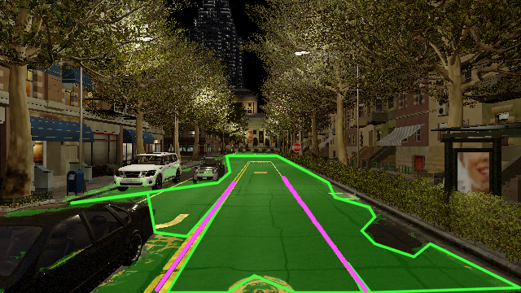
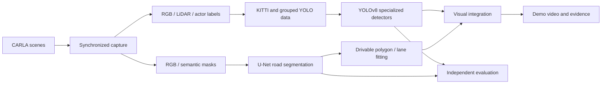

<a id="readme-top"></a>

<div align="center">
  
  <h1>CARLA Urban Perception</h1>
  <p>A visual perception project for simulated urban driving.<br>YOLOv8 object detection · U-Net road segmentation · lane geometry · reproducible evaluation</p>
  <p><strong>English</strong> · <a href="README.zh-CN.md">简体中文</a></p>
  <p><a href="#visual-showcase">View results</a> · <a href="#getting-started">Get started</a> · <a href="docs/architecture.md">Explore architecture</a> · <a href="https://github.com/xuzihao723/xiaomi-auto-drive/releases">Download artifacts</a></p>
  <p>
    
    
    
    
  </p>
</div>

> An independent learning and simulation project, maintained in the `xiaomi-auto-drive` repository. It is not an official Xiaomi product. The implemented scope is data engineering and visual perception; planning and vehicle control remain future work.

<details>
<summary><strong>Table of contents</strong></summary>

- [About the project](#about-the-project)
- [Visual showcase](#visual-showcase)
- [Results at a glance](#results-at-a-glance)
- [System architecture](#system-architecture)
- [Explore the modules](#explore-the-modules)
- [Engineering decisions](#engineering-decisions)
- [Getting started](#getting-started)
- [Repository layout](#repository-layout)
- [Roadmap and limitations](#roadmap-and-limitations)
- [Maintainer and contributions](#maintainer-and-contributions)
- [License and acknowledgments](#license-and-acknowledgments)

</details>

## About the project

This project builds a traceable perception workflow around CARLA urban scenes: synchronize RGB and LiDAR, create KITTI and YOLO datasets, detect four classes of road objects, segment drivable areas and lane markings, and combine the outputs in a video demonstration.

The repository is organized by **technical responsibility**. The original four-week sequence is preserved in the [development log](docs/development-log.md) and release tags.

**Built with:** CARLA 0.9.15, Windows 11 + WSL2 / Ubuntu 22.04, Python 3.10, PyTorch, Ultralytics YOLOv8, U-Net, OpenCV, NumPy and Matplotlib. ONNX and TensorRT are used for optional deployment benchmarks.

## Visual showcase

[](road-segmentation/demo/README.md)

*Actual frames from the published fusion demo: object boxes, drivable-area overlays and fitted lane curves. The “Week 4” labels belong to the original recording.*

**[Download the 60-second fusion demo package](https://github.com/xuzihao723/xiaomi-auto-drive/releases/download/week4-submission/xiaomi_week4.zip)** · [Video metadata and checksum](road-segmentation/demo/README.md)

<details>
<summary>Inspect road geometry and evaluation evidence</summary>



The image above is an **audit-set example**, not the fixed test set. See the [segmentation experiment notes](docs/experiments.md#road-segmentation) for the distinction.

- [Detection PR curve](object-detection/evaluation/BoxPR_curve.png)
- [Inference benchmark comparison](object-detection/reports/inference_benchmark_comparison.png)
- [Segmentation training curves](road-segmentation/reports/training_curves.png)
- [Night adaptation comparison](road-segmentation/reports/night_adaptation_comparison.json)

</details>

## Results at a glance

| Capability | Published result | Evaluation scope |
| :--- | :--- | :--- |
| Four-class detection | **mAP50 0.704** / mAP50–95 0.403 | 300 strictly grouped test images; 3,472 targets |
| Road and lane segmentation | **Road/Lane mIoU 0.676** | 175 fixed test images; background excluded from this mean |
| Integrated visualization | **60 seconds** / 900 frames | 640 × 360, 15 FPS; output-video rate, not measured inference throughput |

Under the same strict detection test protocol, class-specialized fusion improves mAP50 from **0.473 to 0.704** (+0.231 absolute). On the separate 75-image segmentation audit set, Road/Lane mIoU is **0.796**. These two segmentation sets are reported separately.

Metrics are linked to [raw JSON, dataset splits and experiment comparisons](docs/experiments.md). Full per-class tables and deployment timings live in the module documentation.

## System architecture


```mermaid
flowchart LR
    S[CARLA scenes] --> C[Synchronized capture]
    C --> D[RGB / LiDAR / actor labels]
    C --> M[RGB / semantic masks]
    D --> K[KITTI and grouped YOLO data]
    K --> Y[YOLOv8 specialized detectors]
    M --> U[U-Net road segmentation]
    U --> G[Drivable polygon / lane fitting]
    Y --> F[Visual integration]
    G --> F
    Y --> E[Independent evaluation]
    U --> E
    F --> V[Demo video and evidence]
```

LiDAR supports the data pipeline; the demonstrated detectors and segmenter use RGB images. Visual integration combines rendered perception outputs, without claiming sensor fusion or closed-loop driving. [Read the architecture and module contracts →](docs/architecture.md)

## Explore the modules

| Module | What to explore | Entry point |
| :--- | :--- | :--- |
| **Simulation** | Windows CARLA Server, WSL2 client, traffic and manual-driving validation | [simulation/](simulation/README.md) |
| **Data pipeline** | Frame-aligned RGB/LiDAR capture, projection, KITTI conversion and validation | [data-pipeline/](data-pipeline/README.md) |
| **Object detection** | Four classes, grouped splits, dual-model inference, label review and backend benchmarks | [object-detection/](object-detection/README.md) |
| **Road segmentation** | Three-class U-Net, night adaptation, drivable-area extraction and lane fitting | [road-segmentation/](road-segmentation/README.md) |

Each module has an English entry page and a linked Chinese guide. Original experiment reports remain available in Chinese.

## Engineering decisions

| Problem | Project approach | Evidence |
| :--- | :--- | :--- |
| Adjacent frames can leak across dataset splits | Group by scene / continuous-frame block, with buffer frames and overlap checks | [Split validation](object-detection/reports/grouped_validation.json) |
| Road users and small traffic-control objects need different attention | Assign vehicles/pedestrians and lights/signs to specialized YOLOv8 models | [Fusion evaluation](object-detection/reports/evaluation_metrics_fusion_test.json) |
| Incomplete labels can distort reported accuracy | Review 150 old independent test images and keep traceable corrections | [Review evidence](object-detection/evaluation/traffic_review/) |
| Night scenes expose a segmentation domain gap | Adapt with night scenes and report both improvement and weather tradeoffs | [Before/after metrics](road-segmentation/reports/night_adaptation_comparison.json) |

Night test mIoU improves from **0.004 to 0.778**, while heavy-rain test mIoU changes from **0.659 to 0.637**. The tradeoff is retained in the published results.

## Getting started

### Browse without running CARLA

Start with the [visual showcase](#visual-showcase), [experiment evidence](docs/experiments.md) and [release artifacts](https://github.com/xuzihao723/xiaomi-auto-drive/releases). The static bilingual portfolio is in [site/](site/README.md); its hosting instructions are included there.

### Set up the perception environment

The recorded training environment uses **Python 3.10 on WSL2 Ubuntu 22.04**. A compatible NVIDIA GPU is needed to reproduce the recorded CUDA runs. CARLA Server 0.9.15 is needed for new data collection, not for browsing saved results.

```bash
git clone https://github.com/xuzihao723/xiaomi-auto-drive.git
cd xiaomi-auto-drive/road-segmentation
python3.10 -m venv .venv
source .venv/bin/activate
python -m pip install -r requirements.txt
```

Before inference, download the detection and segmentation release packages and copy the selected published weights into these locations:

```text
object-detection/weights/road_user_best.pt
object-detection/weights/traffic_control_best.pt
road-segmentation/weights/unet_week4_best.pt
```

Large weights and videos are **release downloads**, not files included by `git clone`. The 1,300 raw segmentation image/mask pairs are not bundled in the release: regenerate them with the published collector and scene configuration. See the [step-by-step setup guide](docs/getting-started.md) before training or running the integrated demo.

## Repository layout

```text
xiaomi-auto-drive/
├── README.md                  # English project overview
├── README.zh-CN.md            # Chinese project overview
├── simulation/                # Environment and simulator validation
├── data-pipeline/             # Capture, conversion and data checks
├── object-detection/          # YOLOv8 training, evaluation and deployment
├── road-segmentation/         # U-Net, geometry and visual integration
├── docs/                      # Architecture, experiments and development log
└── site/                      # Bilingual static portfolio and shared images
```

Directory names have changed; historical release tags and archive layouts retain their original names. [Migration map and artifact placement →](docs/getting-started.md#directory-migration)

## Roadmap and limitations

- [x] Synchronized CARLA capture and KITTI conversion.
- [x] Four-class detection with grouped evaluation and label-review evidence.
- [x] Road/lane segmentation, geometric extraction and visual integration.
- [x] English/Chinese project overviews and a static portfolio page.
- [ ] Real-world camera-domain validation and more varied scenarios.
- [ ] Temporal lane constraints and robust handling of occlusion / sharp curves.
- [ ] Planning, control and closed-loop driving evaluation.
- [ ] Camera-to-control latency on an actual automotive compute platform.

Published data comes primarily from CARLA Town05 and Town10HD_Opt. Small traffic-control targets remain difficult. Lane fitting is a geometric heuristic over predicted pixels. Notebook PyTorch/ONNX/TensorRT benchmarks do not establish vehicle-level real-time performance.

## Maintainer and contributions

Maintained by **[xuzihao723](https://github.com/xuzihao723)**. This repository documents project work in data engineering, model training, evaluation and demo integration; it builds on CARLA and existing learning frameworks.

For questions or proposed improvements, [open an issue](https://github.com/xuzihao723/xiaomi-auto-drive/issues). Contributions should describe the affected module, reproduction steps, and evaluation conditions. Keep large models/datasets out of Git and preserve raw experiment evidence.

## License and acknowledgments

No project-wide license has been declared in this repository. Third-party libraries and artifacts remain subject to their respective licenses; no license badge is implied.

- [CARLA](https://github.com/carla-simulator/carla), [Ultralytics](https://github.com/ultralytics/ultralytics), [PyTorch](https://github.com/pytorch/pytorch) and [OpenCV](https://github.com/opencv/opencv).

<p align="right"><a href="#readme-top">Back to top ↑</a></p>
