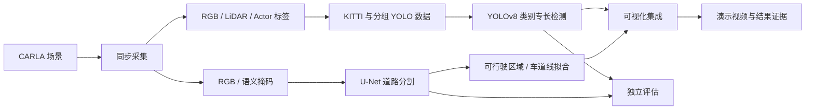

<a id="readme-top"></a>

<div align="center">
  
  <h1>CARLA 城市道路视觉感知系统</h1>
  <p>面向城市道路仿真的视觉感知项目。<br>YOLOv8 目标检测 · U-Net 道路分割 · 车道线几何提取 · 可追溯实验评估</p>
  <p><a href="README.md">English</a> · <strong>简体中文</strong></p>
  <p><a href="#visual-showcase">查看效果</a> · <a href="#getting-started">开始使用</a> · <a href="docs/architecture.md">系统架构</a> · <a href="https://github.com/xuzihao723/xiaomi-auto-drive/releases">下载成果</a></p>
  <p>
    
    
    
    
  </p>
</div>

> 本项目用于独立学习与仿真实验，保存在 `xiaomi-auto-drive` 仓库中，不代表小米汽车官方产品。当前已实现数据工程与视觉感知，规划控制属于后续工作。

<details>
<summary><strong>目录导航</strong></summary>

- [项目介绍](#about-the-project)
- [效果展示](#visual-showcase)
- [核心成果](#results-at-a-glance)
- [系统架构](#system-architecture)
- [技术模块](#explore-the-modules)
- [关键工程决策](#engineering-decisions)
- [开始使用](#getting-started)
- [仓库结构](#repository-layout)
- [后续计划与当前边界](#roadmap-and-limitations)
- [维护者与贡献](#maintainer-and-contributions)
- [许可与致谢](#license-and-acknowledgments)

</details>

<a id="about-the-project"></a>
## 项目介绍

围绕 CARLA 城市道路场景构建可追溯的感知实验流程：同步采集 RGB 与 LiDAR，生成 KITTI 和 YOLO 数据集，检测四类道路目标，分割可行驶区域与车道线，并将感知结果合成为演示视频。

仓库按**技术职责**组织。原来的四周开发过程保留在[开发记录](docs/development-log.md)及历史 Release 标签中。

**技术栈：** CARLA 0.9.15、Windows 11 + WSL2 / Ubuntu 22.04、Python 3.10、PyTorch、Ultralytics YOLOv8、U-Net、OpenCV、NumPy、Matplotlib；ONNX 和 TensorRT 用于可选的部署测速。

<a id="visual-showcase"></a>
## 效果展示

[](road-segmentation/demo/README.md)

*已发布融合视频的真实画面：目标框、可行驶区域叠加和拟合车道线。图中的 “Week 4” 来自原始录制。*

**[下载 60 秒融合演示提交包](https://github.com/xuzihao723/xiaomi-auto-drive/releases/download/week4-submission/xiaomi_week4.zip)** · [视频信息与校验值](road-segmentation/demo/README.md)

<details>
<summary>展开道路几何示例与评估证据</summary>


上图为**审计集示例**，与固定 test 不属于同一个评估集。划分说明见[分割实验记录](docs/experiments.md#road-segmentation)。

- [检测 PR 曲线](object-detection/evaluation/BoxPR_curve.png)
- [推理后端测速对比](object-detection/reports/inference_benchmark_comparison.png)
- [分割训练曲线](road-segmentation/reports/training_curves.png)
- [夜间适配对比](road-segmentation/reports/night_adaptation_comparison.json)

</details>

<a id="results-at-a-glance"></a>
## 核心成果

| 能力 | 已发布结果 | 评估口径 |
| :--- | :--- | :--- |
| 四类别目标检测 | **mAP50 0.704** / mAP50–95 0.403 | 严格分组 test：300 张图像、3,472 个目标 |
| 道路与车道线分割 | **Road/Lane mIoU 0.676** | 固定 test：175 张图像；该均值不包含背景类别 |
| 感知融合可视化 | **60 秒** / 900 帧 | 640 × 360、15 FPS；这是视频输出帧率，并非推理吞吐率 |

同一严格检测评估口径下，类别专长融合将 mAP50 从 **0.473 提升至 0.704**，绝对提升 0.231。分割另有模型固定后评估的 75 张审计集，Road/Lane mIoU 为 **0.796**；两种分割评估集分别报告。

指标可追溯到[原始 JSON、数据划分与实验对比](docs/experiments.md)。逐类别指标和部署速度放在模块文档中，便于进一步核查。

<a id="system-architecture"></a>
## 系统架构



LiDAR 用于数据管线，展示的检测器与分割器均以 RGB 为输入。可视化集成合并感知渲染结果，尚未实现传感器级融合或闭环驾驶。[查看架构与模块职责 →](docs/architecture.md)

<a id="explore-the-modules"></a>
## 技术模块

| 模块 | 主要内容 | 中文入口 |
| :--- | :--- | :--- |
| **仿真环境** | Windows CARLA Server、WSL2 Client、交通流与人工驾驶验证 | [simulation/](simulation/README.zh-CN.md) |
| **数据管线** | RGB/LiDAR 帧对齐采集、坐标投影、KITTI 转换与校验 | [data-pipeline/](data-pipeline/README.zh-CN.md) |
| **目标检测** | 四类别检测、分组划分、双模型推理、标签复核与后端测速 | [object-detection/](object-detection/README.zh-CN.md) |
| **道路分割** | 三分类 U-Net、夜间适配、区域提取与车道线拟合 | [road-segmentation/](road-segmentation/README.zh-CN.md) |

各模块均提供英文入口和中文版指南。原始实验报告继续保留中文版本。

<a id="engineering-decisions"></a>
## 关键工程决策

| 问题 | 项目处理 | 证据 |
| :--- | :--- | :--- |
| 相邻帧跨划分可能导致数据泄漏 | 按场景 / 连续帧块分组，设置缓冲帧并检查重叠 | [划分校验](object-detection/reports/grouped_validation.json) |
| 道路参与者与交通控制小目标的难点不同 | 两个 YOLOv8 模型分别承担车辆/行人与交通灯/标志 | [融合评估](object-detection/reports/evaluation_metrics_fusion_test.json) |
| 不完整标签可能扭曲指标 | 人工复核旧独立 test 的 150 张图像，保留纠错记录 | [人工复核证据](object-detection/evaluation/traffic_review/) |
| 夜间场景存在分割域差距 | 加入夜间适配，同时报告收益与天气权衡 | [适配前后指标](road-segmentation/reports/night_adaptation_comparison.json) |

夜间 test mIoU 从 **0.004 提升至 0.778**，暴雨 test mIoU 从 **0.659 变为 0.637**。天气权衡保留在最终结果中。

<a id="getting-started"></a>
## 开始使用

### 仅浏览成果

可从[效果展示](#visual-showcase)、[实验记录](docs/experiments.md)和 [Release 附件](https://github.com/xuzihao723/xiaomi-auto-drive/releases)开始。双语静态作品页位于 [site/](site/README.md)，其中附有托管说明。

### 配置感知环境

已记录的训练环境为 **WSL2 Ubuntu 22.04 / Python 3.10**。复现原 CUDA 实验需兼容的 NVIDIA GPU。采集新数据需要 CARLA Server 0.9.15；浏览已有结果无需运行仿真。

```bash
git clone https://github.com/xuzihao723/xiaomi-auto-drive.git
cd xiaomi-auto-drive/road-segmentation
python3.10 -m venv .venv
source .venv/bin/activate
python -m pip install -r requirements.txt
```

推理前，下载检测与分割提交包，将最终权重分别放到：

```text
object-detection/weights/road_user_best.pt
object-detection/weights/traffic_control_best.pt
road-segmentation/weights/unet_week4_best.pt
```

大权重和视频通过 **Release 下载**，不随 `git clone` 获取。1,300 组原始分割图像与掩码不包含在 Release 中，需要按公开的采集代码和场景配置重新生成。训练及融合演示前请先阅读[分步复现指南](docs/getting-started.md)。

<a id="repository-layout"></a>
## 仓库结构

```text
xiaomi-auto-drive/
├── README.md                  # 英文项目总览
├── README.zh-CN.md            # 中文项目总览
├── simulation/                # 仿真环境与验证
├── data-pipeline/             # 采集、转换与数据校验
├── object-detection/          # YOLOv8 训练、评估与部署
├── road-segmentation/         # U-Net、几何处理与可视化集成
├── docs/                      # 架构、实验与开发记录
└── site/                      # 双语静态作品页及共享图片
```

目录已按模块命名；历史 Release 标签与压缩包内部布局保持原名。[目录迁移与附件放置说明 →](docs/getting-started.md#directory-migration)

<a id="roadmap-and-limitations"></a>
## 后续计划与当前边界

- [x] CARLA 同步采集与 KITTI 转换。
- [x] 四类别检测、分组评估与标签复核证据。
- [x] 道路/车道分割、几何提取与可视化集成。
- [x] 中英文项目首页与静态作品页。
- [ ] 真实相机域验证与更丰富的场景。
- [ ] 车道线时序约束，以及遮挡 / 急弯处理。
- [ ] 规划、控制与闭环驾驶评估。
- [ ] 真实车载计算平台上的相机到控制端到端延迟。

数据主要来自 CARLA Town05 和 Town10HD_Opt。交通控制小目标仍有较大难度；车道拟合是基于预测像素的几何启发式处理。笔记本 PyTorch/ONNX/TensorRT 测速不能直接代表车载实时能力。

<a id="maintainer-and-contributions"></a>
## 维护者与贡献

维护者：**[xuzihao723](https://github.com/xuzihao723)**。仓库展示了数据工程、模型训练、评估与演示集成等项目工作，基于 CARLA 和现有学习框架构建。

问题与建议可通过 [Issues](https://github.com/xuzihao723/xiaomi-auto-drive/issues)提出。贡献时请说明涉及模块、复现步骤和评估条件；大模型与数据集通过 Release 分发，并保留原始实验记录。

<a id="license-and-acknowledgments"></a>
## 许可与致谢

仓库尚未声明项目级许可证。第三方库和附件遵循各自许可，首页不添加未经确认的许可证徽章。

- [CARLA](https://github.com/carla-simulator/carla)、[Ultralytics](https://github.com/ultralytics/ultralytics)、[PyTorch](https://github.com/pytorch/pytorch)、[OpenCV](https://github.com/opencv/opencv)。
- README 的组织与展示参考了 [awesome-readme](https://github.com/matiassingers/awesome-readme) 和 [Best-README-Template](https://github.com/othneildrew/Best-README-Template)。

<p align="right"><a href="#readme-top">返回顶部 ↑</a></p>
