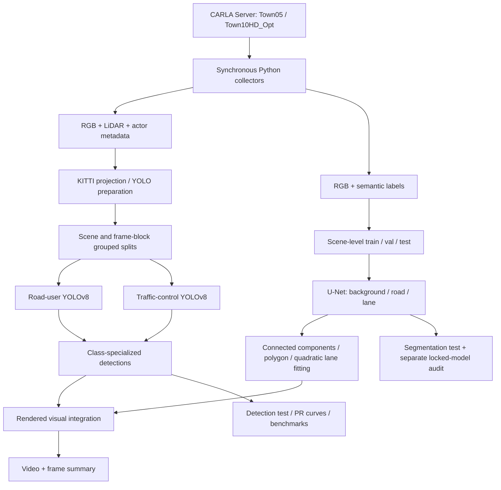

# System architecture

[Project overview](../README.md) · [中文项目首页](../README.zh-CN.md) · [Experiment evidence](experiments.md)

## Implemented scope

The system is a CARLA data and RGB-perception workflow. It captures synchronized sensors, creates reproducible datasets, evaluates object detection and road segmentation, and renders an integrated demo. Planning, control and closed-loop driving are not implemented.

## Module contracts

| Module | Inputs | Responsibilities | Outputs |
| --- | --- | --- | --- |
| [simulation](../simulation/README.md) | CARLA package and host networking | Server/client setup, traffic and manual-control validation | Setup documentation and screenshots |
| [data-pipeline](../data-pipeline/README.md) | RGB, LiDAR and actor ground truth | Frame alignment, projection, KITTI conversion and validation | Images, point clouds, calibration, labels and summaries |
| [object-detection](../object-detection/README.md) | Grouped four-class YOLO dataset | Train, select checkpoints, review labels, combine specialized models, evaluate and benchmark | Detection weights, metrics, curves and rendered video |
| [road-segmentation](../road-segmentation/README.md) | RGB and three-class masks | Train U-Net, adapt to night scenes, extract geometry and integrate detections | Segmentation weights, masks, polygons, fitted curves and fusion video |

## Important invariants

- **Synchronized capture:** collectors align sensor messages with the CARLA world frame. LiDAR is collected for the data pipeline; the demonstrated perception models consume RGB.
- **Grouped evaluation:** final detection splits use scene/continuous-frame blocks and buffers, not a random shuffle of adjacent frames. Segmentation uses fixed scene-level splits; audit images are evaluated separately after model fixation.
- **Specialized predictions:** the road-user model supplies Car/Pedestrian; the traffic-control model supplies TrafficLight/TrafficSign. Integration draws these outputs together with segmentation geometry.
- **Runtime label mapping:** the semantic collector reads `carla.CityObjectLabel` for the installed CARLA API rather than relying on an outdated hard-coded webpage order.
- **Evidence preservation:** JSON/CSV, label review and published images remain the original records. Absolute machine paths in old result JSONs describe the original run and are not current setup instructions.
- **Artifact separation:** Git stores code, configuration, documentation and small reviewable results. Published weights and videos are distributed in historical Releases. Raw segmentation images must be regenerated.

## Integration entry point

Run `road-segmentation/integration/integrated_demo.py` from the segmentation module directory. Supply the final segmentation weight and the two detection weights from `../object-detection/weights/`. The script also writes frame counts and geometry summaries. Its `--fps` argument controls output-video playback speed, not a model throughput measurement.

See [getting started](getting-started.md) for the complete paths and prerequisites, and the [development log](development-log.md) for historical release mappings.
