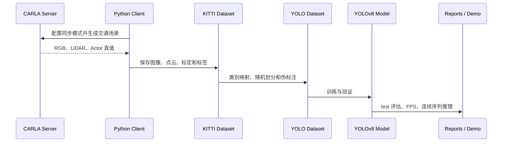

# 系统架构说明

## 1. 总体目标

项目以 CARLA 城市道路仿真为数据源，逐步建立从环境运行、传感器采集、数据转换到视觉感知模型训练与评估的可复现实验链路。

## 2. 模块划分

| 模块 | 输入 | 处理 | 输出 |
| --- | --- | --- | --- |
| 仿真环境 | CARLA 地图、车辆与交通参与者配置 | 启动 Server、生成车辆和行人、运行同步世界 | 可控城市道路场景 |
| 传感器采集 | RGB 相机、LiDAR、Actor 状态 | 同步采样、帧号对齐、元数据记录 | 图像、点云和逐帧元数据 |
| 数据转换 | CARLA 原始数据 | 坐标投影、可见性过滤、边界框计算 | KITTI Object 数据集 |
| 数据准备 | KITTI 图片和标签 | 随机划分、标签转换、交通控制目标伪标注 | 四类别 YOLO 数据集 |
| 感知训练 | YOLO 数据集、预训练 YOLOv8n | 微调、验证、checkpoint 保存 | `best.pt` 与训练记录 |
| 性能评估 | 独立 test 集、最佳权重 | 计算 P/R/mAP、PR 曲线、混淆矩阵和 FPS | 指标 JSON、图表与报告 |
| 连续推理 | 1000 帧原始道路图像 | 四类别检测、结果渲染、视频编码 | 约一分钟演示视频 |

## 3. 数据流

## 4. 关键设计

### 同步采集

CARLA 世界、RGB 相机与 LiDAR 使用相同仿真帧号。客户端在每次 `world.tick()` 后等待对应帧传感器数据，避免图像、点云和标注错位。

### 可移植配置

数据配置使用相对路径，不写入个人电脑盘符或用户名。大型数据和训练权重不进入 Git 历史，通过每周 Release 分发。

### 独立测试

数据按固定随机种子划分为 train、val 和 test。训练选择依据 val 集，最终性能由独立 test 集报告。

### 可追溯结果

训练记录、数据统计、评估指标、视频统计和实验报告分别保存为 CSV、JSON、PNG、PDF 与 MP4，便于复查和复现。

## 5. 版本与交付映射

| 版本标签 | 交付阶段 | 主要内容 |
| --- | --- | --- |
| `week1-submission` | 环境搭建 | 文档、截图、CARLA 演示视频 |
| `week2-submission` | 数据工程 | 采集代码、配置、1000 帧 KITTI 数据 |
| `week3-submission` | 视觉感知 | 四分类模型、评估、报告和演示视频 |

