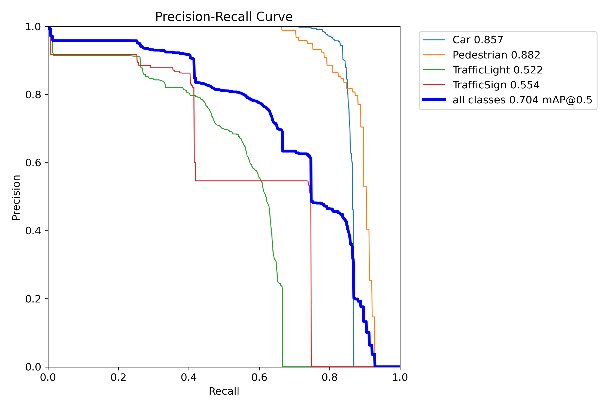

# Object detection

**English** · [简体中文](README.zh-CN.md) · [Project overview](../README.md)

Four-class YOLOv8 perception for CARLA scenes: **Car, Pedestrian, TrafficLight and TrafficSign**. The final inference path combines a road-user model and a traffic-control model, retaining only each model's assigned classes.

## Dataset and evaluation

- Town05 / Town10HD_Opt, with varied weather, lighting and seeds.
- 1,600 grouped images: 960 train / 340 validation / 300 test.
- Scene/continuous-frame blocks with buffer frames; recorded group/hash overlap is zero.
- Final test: Precision **0.880**, Recall **0.590**, mAP50 **0.704**, mAP50–95 **0.403**.
- Same-test previous single model: mAP50 0.473 / mAP50–95 0.361.



## Setup and artifacts

Use Python 3.10 in the recorded WSL2 environment and install `requirements.txt` in an activated virtual environment. Download the [historical detection package](https://github.com/xuzihao723/xiaomi-auto-drive/releases/download/week3-submission/xiaomi_week3.zip); place `road_user_best.pt` and `traffic_control_best.pt` in this module's `weights/` directory. Restore/regenerate the grouped dataset under `data/yolo_grouped/` before training or test evaluation.

Commands below run from `object-detection/`:

```bash
python -m pip install -r requirements.txt
python detection/train_yolov8.py \
  --data configs/data_grouped.yaml --epochs 40 --batch 8 --device 0
python detection/evaluate_class_fusion.py \
  --road-user-weights weights/road_user_best.pt \
  --traffic-control-weights weights/traffic_control_best.pt \
  --data configs/data_grouped.yaml --split test --imgsz 640 --batch 8 --device 0 \
  --output-dir outputs/evaluation \
  --output-json outputs/evaluation_metrics_fusion_test.json
```

Generated outputs are kept separate from the archived evaluation evidence. Installation alone does not provide data or weights.

## Explore the evidence

| Topic | Entry point |
| --- | --- |
| Final per-class metrics | [Evaluation JSON](reports/evaluation_metrics_fusion_test.json) |
| Grouped splits | [Dataset summary](reports/dataset_summary_grouped.json) / [validation](reports/grouped_validation.json) |
| Separate 150-image old-test manual review | [Review records](evaluation/traffic_review/) |
| PyTorch / ONNX / TensorRT benchmarks | [Benchmark records](reports/inference_benchmarks/) |
| Training | [40-epoch curve](training/results.png) |
| Demo download | [Video note](demo/README.md) |
| Detailed commands and report | [Chinese guide](README.zh-CN.md) |

The notebook benchmark excludes disk decoding and does not establish automotive end-to-end latency. Small, distant traffic-control targets remain difficult. See [experiment protocols](../docs/experiments.md) and [road segmentation](../road-segmentation/README.md) for integrated visualization.
