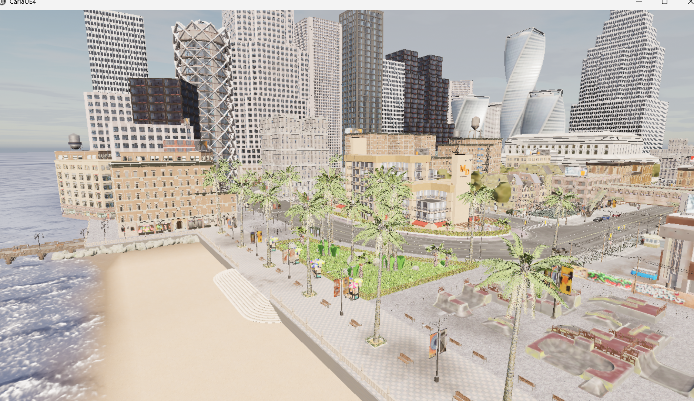

# Simulation environment

**English** · [简体中文](README.zh-CN.md) · [Project overview](../README.md)

Environment setup and validation for CARLA 0.9.15: Windows Server, a WSL2 Ubuntu 22.04 Python client, traffic generation and manual driving. This module contains setup records and screenshots; it is not a closed-loop autonomous controller.

## Verified workflow

1. Install the CARLA 0.9.15 Windows package and launch the Server.
2. Prepare Python 3.10 and the matching CARLA client in WSL2.
3. Verify host networking and client/server communication.
4. Run traffic generation and manual control, retaining screenshots and a short video.

## Documentation and artifacts

- [Environment setup record (Chinese)](docs/environment_setup.md)
- [Experiment report (Chinese)](docs/experiment_report.md)
- [Learning notes (Chinese)](docs/xiaomi_autonomous_driving_note.md)
- [Manual-control screenshot](screenshots/03_manual_control.png)
- [Historical release package](https://github.com/xuzihao723/xiaomi-auto-drive/releases/download/week1-submission/xiaomi_week1.zip), including the 30-second simulator video.

Continue with the [data pipeline](../data-pipeline/README.md) once the environment is working.
