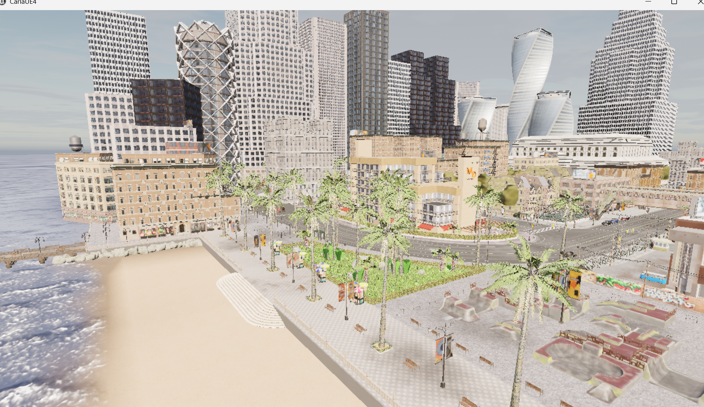
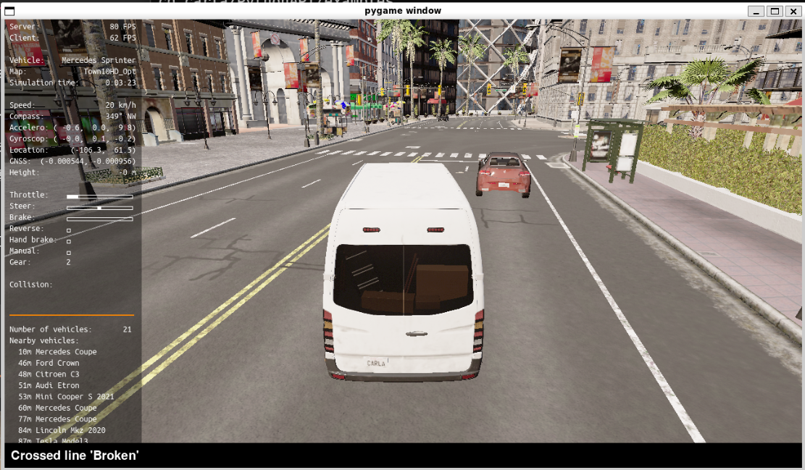

# Week 1：环境搭建与 CARLA 仿真验证

第一周完成自动驾驶仿真项目的基础环境搭建，验证 Windows CARLA Server 与 WSL2 Ubuntu Python Client 的通信，并完成交通流和人工驾驶测试。

## 本目录内容

- `docs/environment_setup.md`：环境安装与配置记录。
- `docs/xiaomi_autonomous_driving_note.md`：项目学习笔记。
- `docs/experiment_report.md`：第一周实验记录。
- `screenshots/01_carla_server.png`：CARLA Server 启动结果。
- `screenshots/02_generate_traffic.png`：交通流生成结果。
- `screenshots/03_manual_control.png`：人工驾驶验证结果。

30 秒 CARLA 演示视频包含在完整提交包中，不放入 Git 主分支：

- [下载 xiaomi_week1.zip](https://github.com/xuzihao723/xiaomi-auto-drive/releases/download/week1-submission/xiaomi_week1.zip)
- [查看 Week 1 Release](https://github.com/xuzihao723/xiaomi-auto-drive/releases/tag/week1-submission)

## 验证结果

